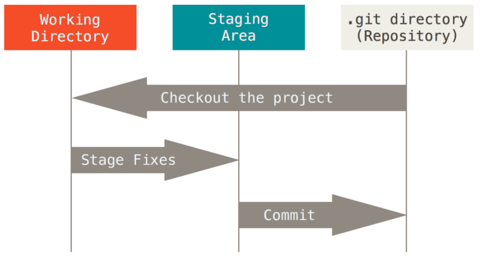
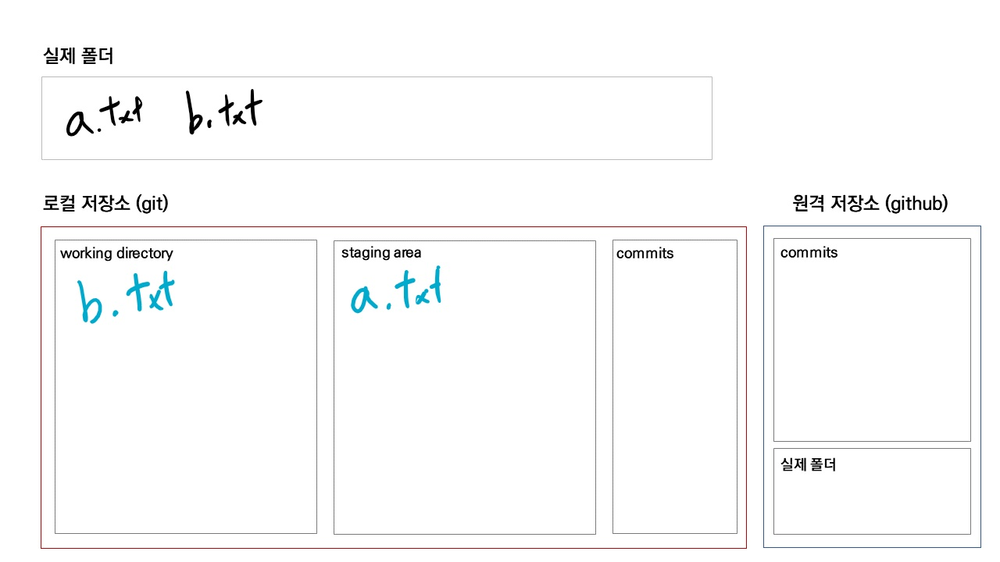
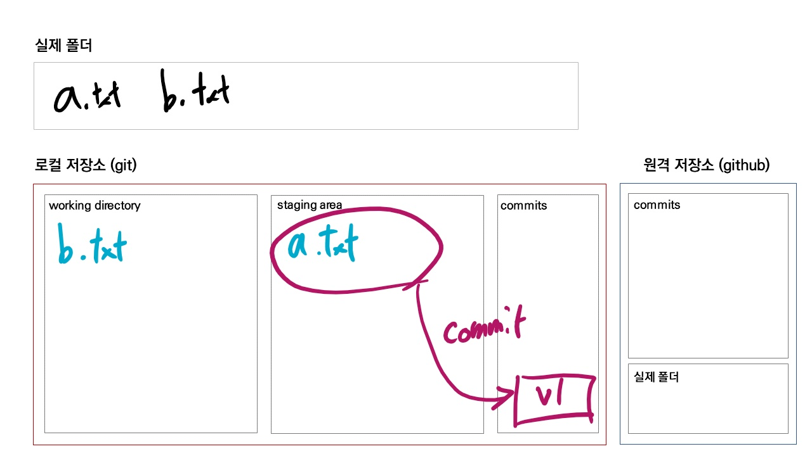
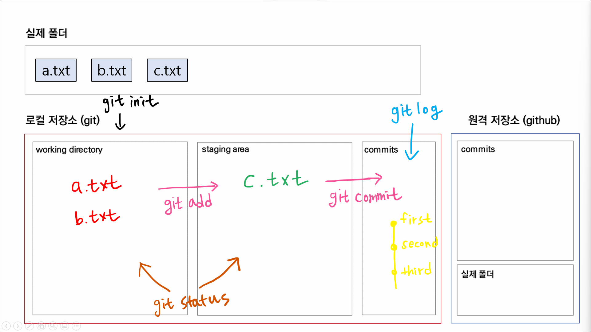

[toc]

## Git 초기 설정

> 최초 한 번만 설정합니다. 매번 Git을 사용할 때마다 설정할 필요가 없습니다.

**커밋 작성자(author) 설정**

```bash
$ git config --global user.email "메일주소"
$ git config --global user.name "유저네임"
```

- 커밋을 작성하는 사람이 누구인지 알아야하기 때문

<br>

**올바르게 설정되었는지 확인**

```bash
$ git config --global -l

# 또는

$ git config --global --list
```

<br>

---

## Git Basic

### 로컬 저장소



- `Working Directory (= Working Tree)` : 사용자의 일반적인 작업이 일어나는 곳
- `Staging Area (= Index)` : 커밋을 위한 파일 및 폴더가 추가되는 곳
- `Repository` : staging area에 있던 파일 및 폴더의 변경사항(커밋)을 저장하는 곳
- Git은 **Working Directory → Staging Area → Repository** 의 과정으로 버전 관리를 수행합니다.

<br>

### init

```bash
$ git init

Initialized empty Git repository in C:/Users/student/Desktop/git_class

student@M172 MINGW64 ~/Desktop/git_class (master)
```

- 현재 작업 중인 디렉토리를 Git으로 관리한다는 명령어
- .git 이라는 숨김 폴더를 생성하고, 터미널에는 (master)라고 표기됨

> **주의사항**
>
> - 이미 Git 저장소인 폴더 내에 또 다른 Git 저장소를 만들지 않습니다. (중첩 금지) 
>   즉, 터미널에 이미 (master)가 있다면, git init을 절대 입력하면 안됩니다.
> - 절대로 홈 디렉토리에서 git init을 하지 않습니다. 터미널의 경로가 `~` 인지 확인합니다.

<br>

### add

> staging area / INDEX
>
> - Working Directory에 있는 파일을 Staging Area로 올리는 명령어
> - Git이 해당 파일을 추적(관리)할 수 있도록 만듭니다.
> - `Untracked, Modified` → `Staged` 로 상태를 변경합니다.

```bash
$ git add 파일명
$ git add . # 현재 디렉토리(하위 디렉토리)에 속한 파일/폴더 전부
$ git add a.txt # 특정 파일
$ git add my_folder/ # 특정 폴더
```

```bash
$ touch a.txt b.txt

$ git status
On branch master

No commits yet

Untracked files: # 트래킹 되고 있지 않는 파일 목록
  (use "git add <file>..." to include in what will be committed)
        a.txt
        b.txt

nothing added to commit but untracked files present (use "git add" to track)
```

```bash
$ git add a.txt
```

```bash
$ git status

On branch master

No commits yet

Changes to be committed: # 커밋 예정인 변경사항(staging area)
  (use "git rm --cached <file>..." to unstage)
        new file:   a.txt

Untracked files: # 트래킹 되고 있지 않은 파일
  (use "git add <file>..." to include in what will be committed)
        b.txt
```

> 모든 정보는 `git status` 에 있다.



<br>

### commit

> - Staging Area에 올라온 파일의 변경 사항을 하나의 버전(커밋)으로 저장하는 명령어
> - `커밋 메세지`는 현재 변경 사항들을 잘 나타낼 수 있도록 `의미` 있게 작성하는 것을 권장합니다.
> - 각각의 커밋은 `SHA-1` 알고리즘에 의해 반환 된 고유의 해시 값을 ID로 가집니다.
> - `(root-commit)` 은 해당 커밋이 최초의 커밋 일 때만 표시됩니다. 이후 커밋부터는 사라집니다.

```bash
$ git commit -m "first commit"
[master (root-commit) c02659f] first commit
 1 file changed, 0 insertions(+), 0 deletions(-)
 create mode 100644 a.txt
```

<br>

### log

> - 커밋의 내역(`ID, 작성자, 시간, 메세지 등`)을 조회할 수 있는 명령어
> - 옵션
>   - `--oneline` : 한 줄로 축약해서 보여줍니다.
>   - `--graph` : 브랜치와 머지 내역을 그래프로 보여줍니다.
>   - `--all` : 현재 브랜치를 포함한 모든 브랜치의 내역을 보여줍니다.

```bash
$ git log
commit c02659fc917b40f1ab6106a1727703a7884df12e (HEAD -> master)
Author: edujunho <edujunho.hphk@gmail.com>
Date:   Mon Jun 7 15:29:54 2021 +0900

    first commit
```

```bash
$ git log --oneline # 커밋 목록 한 줄로 보기
c02659f (HEAD -> master) first commit
```



<br>

---

<br>

### status

- working directory, staging area 공간의 파일 상태를 확인할 수 있다.
- 상태 종류
  - `Untracked` : Git이 관리하지 않는 파일 (한번도 Staging Area에 올라간 적 없는 파일)
  - `Tracked` :  Git이 관리하는 파일
    1. `Unmodified` : 최신 상태
    2. `Modified` : 수정되었지만 아직 Staging Area에는 반영하지 않은 상태
    3. `Staged` : Staging Area에 올라간 상태


```bash
$ git status
```




<br>

---

<br>

### 추가 커밋 쌓기

- a.txt 내용 수정

```bash
$ git status
On branch master
Changes not staged for commit:
  (use "git add <file>..." to update what will be committed)
  (use "git restore <file>..." to discard changes in working directory)
        modified:   a.txt

Untracked files:
  (use "git add <file>..." to include in what will be committed)
        b.txt

no changes added to commit (use "git add" and/or "git commit -a")
```

```bash
$ git add a.txt

$ git status
On branch master
Changes to be committed:
  (use "git restore --staged <file>..." to unstage)
        modified:   a.txt

Untracked files:
  (use "git add <file>..." to include in what will be committed)
        b.txt
```

```bash
$ git commit -m "second commit"

[master 4cac5c6] second commit
 1 file changed, 1 insertion(+)
```

```bash
$ git log --oneline
4cac5c6 (HEAD -> master) second commit
c02659f first commit
```

- b.txt 커밋 만들기

```bash
$ git add b.txt

$ git status
On branch master
Changes to be committed:
  (use "git restore --staged <file>..." to unstage)
        new file:   b.txt

$ git commit -m "add b.txt"
[master 6fe9152] add b.txt
 1 file changed, 0 insertions(+), 0 deletions(-)
 create mode 100644 b.txt
```

```bash
$ git log --oneline
6fe9152 (HEAD -> master) add b.txt
4cac5c6 second commit
c02659f first commit
```
