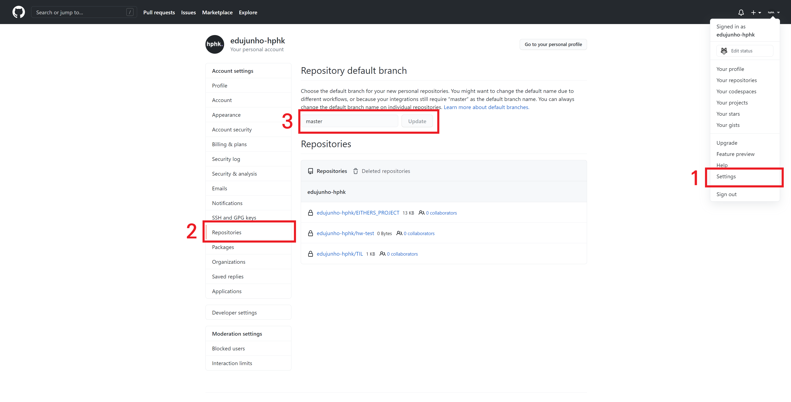

[TOC]

# Github

## 기본 설정

1. https://github.com/ 에 접속 후 회원가입
2. 로컬 git 저장소 사전 준비
3. Repository default branch 변경 (settings -> repositories)
   - main -> `master`로 변경



4. Github repository 생성

<br>

## 원격 저장소 (Remote Repository)

> `git remote`
>
> - 로컬 저장소에 원격 저장소를 등록, 조회, 삭제할 수 있는 명령어

<br>

### 원격 저장소 주소 등록

```bash
$ git remote add origin 저장소URL
```

> "git아, 원격 저장소(remote) 추가해줘(add) origin 이라는 이름으로 저장소  URL을!!!"
>
> - git 명령어를 작성할건데, remote(원격 저장소)에 add(추가) 한다. 
> - origin이라는 이름으로 https://github.com/edukyle/TIL.git라는 주소의 원격 저장소를

<br>

### 원격 저장소 목록 조회

```bash
$ git remote -v
origin  https://github.com/edujunho-hphk/TIL.git (fetch)
origin  https://github.com/edujunho-hphk/TIL.git (push)
```

<br>

### 원격 저장소 주소 삭제

> 로컬과 원격 저장소의 연결을 끊는 것이지, 원격 저장소 자체를 삭제하는 게 아닙니다.

```bash
$ git remote rm origin

# 또는

$ git remote remove origin
```

> "git 명령어를 작성할건데, remote(원격 저장소)와의 연결을 rm(remove, 삭제) 한다. 그 원격 저장소의 이름은 origin이다."

<br>

---

<br>

### 원격 저장소에 업로드 (push)

- 로컬 저장소의 커밋을 원격 저장소에 업로드하는 명령어
- **원격 저장소에는 파일을 업로드하는 게 아니라 커밋을 업로드 하는 것**
- 즉, 커밋 이력이 없다면 push 할 수 없다.
- `-u` 옵션을 사용하면, 두 번째 커밋부터는 저장소 이름, 브랜치 이름을 생략 가능

```bash
$ git push -u origin master

Enumerating objects: 8, done.
Counting objects: 100% (8/8), done.
Delta compression using up to 12 threads
Compressing objects: 100% (4/4), done.
Writing objects: 100% (8/8), 645 bytes | 645.00 KiB/s, done.
Total 8 (delta 0), reused 0 (delta 0), pack-reused 0
To https://github.com/edujunho-hphk/TIL.git
 * [new branch]      master -> master
Branch 'master' set up to track remote branch 'master' from 'origin'.
```

> "git아, push 해줘 origin이라는 이름의 원격저장소에 master 브랜치로!!!!"

> **[주의 사항]**
>
> "Github 원격 저장소에 절대로 파일을 드래그해서 업로드 하지 않습니다."
>
> - 가끔 Github를 구글 드라이브처럼 여겨서, 파일을 직접 드래그해서 올리는 경우가 있습니다. 
> - Git 명령어를 학습했기 때문에, 반드시 git add → git commit → git push 의 단계로만 업로드 해야합니다. 
> - 그 이유는 로컬 저장소와 원격 저장소의 동기화 때문입니다. 
> - 로컬 저장소에서 변경이 먼저 일어나고, 그 변경 사항을 원격 저장소에 반영하는 형태여야 합니다. 
> - 하지만, Github에 드래그를 해서 파일을 업로드하면 원격 저장소에 변경이 먼저 일어나는 형태가 되기 때문에 이러한 행동을 지양해야 합니다.

<br>


